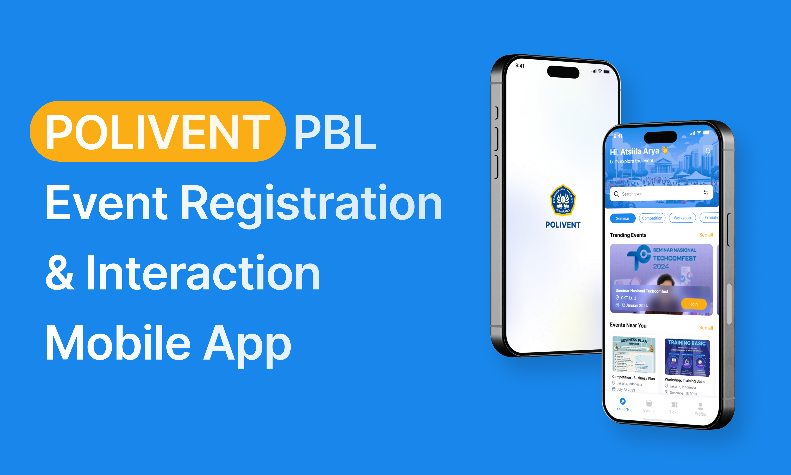

# Polivent App

Polivent is a mobile application developed as part of the **Project-Based Learning (PBL)** assignment for the **Mobile Programming** course. The primary objective of this project is to create a platform for **event registration** and **event interaction**, allowing users to easily explore, register, and interact with events held at **Politeknik Negeri Semarang (Polines)**.



## Features

### 1. **Event Registration**

- **Browse Events**: Users can explore a variety of events ranging from seminars, workshops, competitions, and more.
- **Register for Events**: Allows users to register for selected events with an integrated user authentication system.
- **Ticket Generation**: After registration, users will receive digital tickets that can be used for event check-ins.

### 2. **Event Interaction**

- **Comment and Reply System**: Users can leave comments on event details, reply to others' comments, and engage in discussions.
- **Profile Picture Integration**: Users' comments and replies will include profile pictures, pulled dynamically from the user's account through API/database.
- **Live Feedback**: Real-time updates and interactions related to event discussions.

### 3. **UI/UX Design**

- **Responsive Design**: Designed to ensure smooth and consistent user experience across different devices and screen sizes.
- **Clean and Modern Layout**: Inspired by popular social media platforms, with dynamic pop-up reply fields, customizable avatars, and seamless interaction experience.

### 4. **Additional Features**

- **Push Notifications**: Reminders for upcoming events, announcements, or event updates.
- **Search and Filter**: Easy-to-use search bar and filters to quickly find relevant events based on categories, dates, or organizers.
- **User Authentication**: Login and for personalized event management.

## Technologies Used

- **Flutter**: For cross-platform mobile development.
- **Dart**: Programming language used in Flutter.
- **REST API**: To fetch event data, user profiles, and comments from the backend.

## Installation

To run the app locally, follow these steps:

### Prerequisites

- Flutter SDK: [Install Flutter](https://flutter.dev/docs/get-started/install)
- Dart SDK
- Android Studio or VS Code with Flutter Plugin

### Steps

1. **Clone the repository**:

   ```bash
   git clone https://github.com/your-repository/polivent-app.git
   cd polivent-app
   ```

2. **Install dependencies**:

   ```bash
   flutter pub get
   ```

3. **Run the app**:
   ```bash
   flutter run
   ```

Make sure you have an Android or iOS device/emulator set up.

## Project Structure

```bash
lib/
│
├── main.dart               # Main entry point of the application
├── models/                 # Data models for events, comments, and replies
├── screens/                # Screens for various sections (Home, Event Detail, etc.)
├── widgets/                # Reusable widgets (e.g., comment cards, buttons)
├── services/               # API services for data fetching
├── utils/                  # Utility functions and constants
└── assets/                 # Static assets like images and fonts
```

## License

This project is licensed under the MIT License - see the [LICENSE](LICENSE) file for details.

## Acknowledgements

- Flutter community for the excellent documentation and resources.
- Inspiration from leading social media apps for comment system design.
